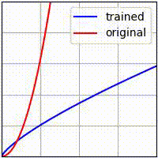

------------------------------------------------
Basic SLP and MLP neural network implementations
------------------------------------------------

Written in C11, everything is public domain

```
Build: $ make

SLP: Single Layer Perceptrons 
	|
	-> SLPnn_exp.c			
	-> SLPnn_twice.c
```


